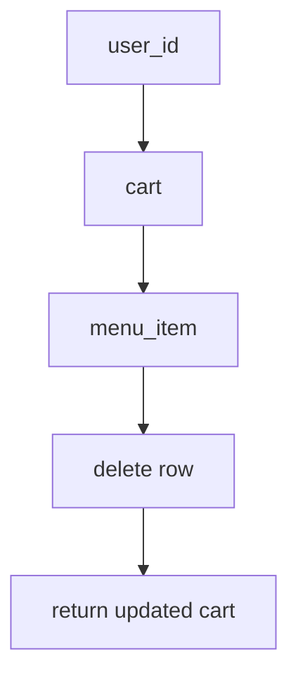

# Python API Note.md

## 購物車 開發筆記/Debug 紀錄
Q1: 測試 post 過程中
```Python commandline
'Then: 回傳成功'
assert res1.status_code == 201
data = res1.json()
assert len(data["items"]) == 1
assert data["items"][0]["quantity"] == 1 # (NG)
"""
1.驗證時需要準確知道索引位置，加上可讀性不好。 
2.list 會有 index 順序性問題，當 quantity=0 ,index 會報錯。
"""
item = next(i for i in data["items"] if i["menu_item_id"] == menu_item_id) (OK)
'改成生成器表達式確保驗證的是正確商品，不依賴 list 順序性'
assert item["quantity"] == 1

```


### Python 生成器表達式 
##### 意思:我要從一堆資料裡找第一個符合條件的元素
```Python commandline
data = {} # dict
menu_item_id = {} # dict

item = next(i for i in data["items"] if i["menu_item_id"] == menu_item_id)
```
透過for/in loop 讀取符合第一個條件的元素，進行比對編號保證驗證是正確的資料  
(在資料比對上比較準確)

next() -> 一個一個取出來  
從 迭代器 iterator（像 list、tuple、generator）拿下一個值的內建函式)

適合像購物車API 測試以下這類型資料 data = res1.json()
```Python commandline
data = []
data["items"] = [
{"menu_item_id": "...", "quantity": 1},
{"menu_item_id": "...", "quantity": 3},
] 
```
##### 解決問題:
1. 可讀性更佳
2. 驗證資料準確性 比 list 更好
3. 預防未來潛在性錯誤
4. 
---

Q2: 測試 post 邏輯累加數量邊界測試
```Python commandline
client = "Test API"

def test_add_same_item_with_accumulation_exceeding_mix_quantity_should_fail():
   # Given: 新增使用者與商品
   user_id = 11
   menu_item_id = str(uuid4())
   # When: 使用者傳入累加數量
   client.post(f"/api/v2/cart/{user_id}/items/",
               json={
                   "menu_item_id": menu_item_id,
                   "quantity": 15
               }
   )
   res_2= client.post(f"/api/v2/cart/{user_id}/items/",
                     json={
                       "menu_item_id": menu_item_id,
                       "quantity": 6
                     }
   )
   # Then: 回應驗證錯誤
   assert res_2.status_code == 400 # bad request(請求不符合業務規則)

```
說明問題:  
累加數量超過上限20,不能是422,驗證欄位與類型有效，
執行時錯誤，累加的數字總和要符合欄位限制，這是屬於累加後邏輯錯誤，通常由400/409比較合適
不選409 比較偏向操作跟目前系統狀態衝突(DB) 
___
##### error msg 
E       assert 201 == 400  
E        +  where 201 = <Response [201 Created]>.status_code  
ex76test_v2.py:268: AssertionError

##### 解決辦法: 修整 API 驗證錯誤 (累加狀態一定需要加一條業務邏輯處理累加上限檢查)
加入累加超過上限檢查 [Guard Clause（防衛式寫法]
```Python commandline
current_quantity = 5
data = {'quantity': 16}
data['quantity'] = 16
if current_quantity + data.quantity > 20: # 累加結果 > 20 會執行raise 中斷
    raise HTTPException(status_code=400,detail="Total quantity cannot exceed 20")
```
---


Q3: 測試 給錯商品編號 讓刪除商品失敗時(item not found)

error 1 : 當查詢時未給 商品編號 變數(str(menu_item_id))),所以結果永遠都是空購物車  
error 2 : 設計上觀念錯誤 [] 不等於是 None 造成條件不成立 

cursor.execute("SELECT menu_item_id, quantity FROM cart_items "
                   "WHERE cart_id = ? AND menu_item_id = ?",
                   (cart_id, str(menu_item_id)))

    ci_row = cursor.fetchall() # 輸出是空 [] 
                                # python 認為 [] 不等於 None, 所以 if 永遠不成立

    if ci_row is None:
        print("404 execute item")
        raise HTTPException(status_code=404, detail="item not found")

#### 解決辦法: 將 if 改為 if not ci_row (業界常用寫法) , 原因: 在 python [] 視為 false
結果: if not ci_row -> if True 成立 raise 404 error

---


### 購物車刪除 設計想法
Delete: 直接刪除資源,本質就是 消失  
**Q1: DELETE 你要刪的是哪一層？ item**

**Q2: DELETE 的「流程是什麼？**  
delete flow : 
找 cart → 找 item → 刪掉那一筆 → 回傳cart 本質是「消失」 -> 直接移除資源

**Q3: DELETE 成功後要回什麼？ 回更新過後的cart**

**Q4: DELETE 的錯誤怎麼處理？**  
1.cart 不存在  404 cart not found  
2.item 不存在  404 item not found  

**Q5: DELETE 跟 PATCH 差在哪？**  
PATCH : 改狀態 (update quantity)  
DELETE : 移除資料 (remove row)  

**Q6: （設計陷阱）# 兩個是不同層級語意**  
PATCH 已經有： quantity = 0 → delete item (原因:業務刪除（語意）)  
DELETE 還要存在嗎？ 要 資源被移除 (原因:REST 刪除（語意）)


**Q7: DELETE 測試你要怎麼想？**
1. 正常刪除 ->item 存在 → 刪掉 → items 少一個
2. item 不存在-> 404
3. cart 不存在-> 404
patch flow :找 cart → 找 item → 改 quantity → 回傳cart 本質是「狀態變更」
->改數量 / 刪掉 item（quantity = 0）

delete flow:  
                user_id → cart  
                        ↓
                    menu_item  
                        ↓
                    delete row  
                        ↓
                return updated cart  

Markdown 支援 Mermaid（GitHub 部分支援  
Markdown 另一種流程寫法


-----------------------------------------------

### 使用者 開發筆記/Debug 紀錄

-----------------------------------------------


-----------------------------------------------

### 餐點 開發筆記/Debug 紀錄

-----------------------------------------------


-----------------------------------------------
### 開始拆分 檔案 職責

#### 解決 資料庫 分散問題 紀錄
建立多個 API ，分散式的資料庫無法建立關聯與後續難以管理；  
需集中 TABLES 連到共享的資料庫 "app.db"；  
讓資料庫形成一個共同儲存空間，這就是 關聯設計(relational design)；  
這樣也是一個共享資料庫的 Core Entity(核心實體)；  
所以要建立一個database 相關架構 將.db/conn/schema.sql 獨自建立出來。 

API_project/
│
├── app/
│   ├── cart.py       # 代表 API endpoint , 這裡會改成路由/入口端點
│   ├── meal.py
│   └── user.py
│
├── db/
│   ├── app.db        # 代表 restaurant.db 儲存庫
│   ├── init_db.py    # 代表 負責建立 table , 只會跑一次,設定 外鍵 ON , 預設是 OFF
│   └── database.py   # 代表 負責 DB connection 例如:get_db_connection() , 用途:未來API 會一職使用這個連線
│
├── test/
│
└── main.py           # API 組裝器 意思是所有 API 啟動開關 ,把所有的API 掛載在一起
___
### 專案調整上的誤解
app/
└── app.db  ❌ API 會被呼染、容易跟code混再一起、之後要換資料庫很難

users.db
meals.db
cart.db     ❌ 資料分裂 無法Join 不符合資料庫設計，資料需要是統一集中管理,方便給整個專案使用 (DB 應該是「全專案共享一個」)

在開發階段 常常容易會把資料、連線、API 邏輯全部寫在同一個.py，因此後續維護時會很困難
但是開發時期，需要經常測試API 功能與流程的完整性，這是專案必要過程
___
#### init_db.py 建立一個app.db,連線部分後續會再拆分出來獨立
init_db.py 先用sqlite3.connnect DB 建立 table 並立馬設定 外鍵ON(Foreign key)
(推薦)
conn = sqlite3.connect("restaurant.db")
conn.execute("PRAGMA foreign_keys = ON") # foreign key 是屬於connect status
(foreign key 是屬於連線狀態中開啟，而不是執行操作狀態下開啟)
❌ cursor.execute("PRAGMA foreign_keys = ON")

**補充一個觀念，購物車本身是一個狀態，並無生命週期，
所謂生命週期指的是有資料長期保存的實體
(user/menu/cart_items/order_items)**
___
#### 測試 DB schema (模式)
```Python commandline
cursor.execute("SELECT name FROM sqlite_master WHERE type='table'")
print("name FROM:",cursor.fetchall()) # 測試 Create TABLE OK

cursor.execute("SELECT name, sql FROM sqlite_master WHERE type='table';")
print("sql FROM:",cursor.fetchall())  # 檢查欄位設計 OK


```
___
```Python commandline
# 測試 Foreign key 生效
try:  
    cursor.execute("""
    INSERT INTO cart_items (id, user_id, menu_id, quantity, added_at)
    VALUES (?, ?, ?, ?, ?)
    """, ("test", 999, "xxx", 1, "2026-01-01"))

    conn.commit()

except Exception as e:
    print("FK test failed:", e)


# UNIQUE constraint 生效
try: 
    cursor.execute("""
                   INSERT INTO users (id, user_name, email, password, created_at) 
                   VALUES (?,?,?,?,?)
                    """,
                   (1,"test","test@email.com",'123', "2026-01-01")
    )
    cursor.execute("""
                    INSERT INTO menus (id, name, price) 
                    VALUES (?,?,?)
                    """
                   ,("m1", "burger", 100)
    )
    cursor.execute("""
                    INSERT INTO cart_items (id, user_id, menu_id, quantity, added_at)
                    VALUES (?,?,?,?,?)"""
                   ,("c2", 1, "m1", 1, "2026-01-01")
    )
except Exception as e:
    print("你的 UNIQUE constraint 生效了->",e)

```


#### DB 完成 schema test 雖然有更動 cart_id / menu_item_id
#### 但接下來，測 cart business logic 時，邊測邊修 API 直到對齊 DB schema
這種屬於重要的工程概念
真正開發時，先穩定 DB schema , 然後再慢慢調整API (在開發測試階段 很正常)
所謂實際工程流程: Interactive Refactoring(迭代式重購)

#### 建立 database.py , 建立連線模組

路徑本身就不屬於API,DB PATH 遷移到 database.py 可以建立所有API 通一路徑
DB_PATH 本身只是用來定位檔案位置，沒有任何連線/傳輸用途

def get_db_connection():
    conn = sqlite3.connect("app.db")
    conn.execute("PRAGMA foreign_keys = ON")
 ***conn.row_factory = sqlite3.Row 　
    return conn

database.py 正確流程
API
  ↓ --> database.py
get_db_connection()
  ↓
sqlite3.connect(DB_PATH)
  ↓
SQLite 引擎
  ↓
執行 SQL
  ↓
回傳結果給 API

預先設定讀取格式  
連線程式 預先設定 當 connect 接收 python 執行查詢 sqlit3 回傳資料(tuple)
因預設取值方式，先透過 sqlite3.Row 物件 轉換格式後(row["name"]), python 才會接收

-----------------------------------------------

### 連線與資料庫 已拆分出去，進行 API Refactor content
### 透過API 測試流程 邊測試邊調整API (迭代式重構)

購物車未完成 API 重構測試，執行 post 發現 cart 改成 cart_items 但是 插入值時 因為cart and cart_item 參數有少
後來發現當初 carts API 將 carts and cart_items 做了混和邏輯，
因為發現說 cart 在有order 系統中才能有作用， carts 屬於暫存狀態(無生命週期) 適合拿來當 order_的快照資料，
所以後來才打算 init_db.py 不建立 cart table ，後來測試 API flow 發現無法測試 , 因為會動到 cart API business logic
所以才重新再init_db.py 建立 cart table

user/meal/cart API and 跌代重構 已測試完成

-----------------------------------------------------------
user/meal/cart = endpoint(終點)
main.py = 把所有 API 拼起來的入口

main.py => API 組裝器 (給uvicorn 伺服器啟動專案 uvicorn main:app --reload)
   ↓
include_router()
   ↓
app/user.py
app/cart.py
app/meal.py

##### 未來API需要優化管理連線的部分: 目前 database.py 只有統一連線，但未統一關閉
問題: 目前 API 連線status
user.py → manual connection  # 要調整架構
cart.py → Depends            # 不動       
meal.py → manual connection  # 要調整架構

Depends = 自動管理「開關 DB connection 的生命週期」
| 寫法      | 問題                     |
| ------- | ---------------------- |
| 手動 conn | 你要自己負責 lifecycle       |
| Depends | FastAPI 幫你管理 lifecycle |
------------------------------------------------
未來會將 連線管理 交由 Fast API 做自動管理 lifecycle 
FastAPI 統一自動管理連線 標準寫法
```Python commandline

def get_db():
    # conn = sqlite3.connect(DB_PATH)
    conn = get_db_connection()
    try:
        yield conn # yield 代表產量 ,產量前(提供DB)/產量後(自動清理)
    finally:
        conn.close()

```
解決: API connect DI (Dependency Injection) 一致性問題 與 職責分離
1.將user and meal API 加入 get_db() ， 透過 FastAPI.depends 管理連線 與 每個 API routes 組合
  重新跑測試程式通過

```Python commandline
@app.post("/api/v1/users", status_code=201, response_model=UserItem)
def created_user(item: UserItem,conn=Depends(get_db)):
```

2.將 `get_db()` 抽離 API，放入 db.py 後 與 get_db_connection() 組合
Flow:
->request
->FastAPI.depends(管理)
->get_db(先自動連線/最後關閉) 
->`get_db_connect(sqlite3.connect)`


API_project/
│
├── app/
│   ├── cart.py
│   ├── meal.py
│   ├── user.py
│   └── dependencies.py   ← 新增  # FastAPI.depends 管理 API routes connect lifecycle(生命週期) 
│
├── db/
│   ├── app.db
│   ├── init_db.py
│   └── database.py       ← 新增 get_db_connect()建立sqlite3連線路徑與設定 and get_db() 與自動連線與關閉連線
│
├── repositories/         ← 新增 # 將SQL 拆分出來，避免以後程式越寫越大時 SQL 語法會比API 還要多，這樣會很亂，程式後面會炸掉，改 DB 很困難
│   ├── cart_repository.py
│   ├── user_repository.py
│   └── meal_repository.py
│
├── test/
│
└── main.py

#### 發現`cart_row[0]`取值不直覺,connect 有設定 `sqlite3.Row` 改成 字典取值，發現 Row 未開啟 ?  
#### 當初`database.py get_db_connect()`連線部分 有設定`sqlite3.Row` 就是為了 fetchone/all 時能開放 dict/tuple 兩種取值方式
```Python commandline
@app.post("/api/v2/cart/{user_id}/items",status_code=201,response_model=CartResponse)
def add_to_cart(user_id: int, data: AddCartItemRequest,conn=Depends(get_db)):
    # 建立時間
    now_taipei = datetime.now(timezone.utc).astimezone(ZoneInfo("Asia/Taipei")).isoformat()
    
    cart_repo = CartRepository(conn)

    cart_row = cart_repo.get_cart_by_user_id(user_id=user_id)

    if cart_row is None:

        cart_repo.create_a_new_cart(user_id=user_id,now_time=now_taipei)

    else:
        originally_cid = cart_row[0] # -> 可讀性優化
        print('originally_cid',originally_cid)

```

後來在 cart_repository.py debug ,查詢到 `self.db = connect` ,仍然是 class sqlite3,代表沒有啟動到 sqlite3.Row
所以改成 `cart_row['id']` , 輸出結果`factory = None`取得只有 tuple 資料

但是後來 debug cart_repository.py 確認 print() 輸出是有 sqlite3.Row
所以轉想可能有其他檔案有設定 sqlite3.connnect 但是未開啟 sqlite.Row 導致
後來想到 test.py 之前 test.db 用的 override_get_db 版本是沒有設定 sqlite3.Row

#### 測試檔案，改成正式的產品連線 database.py -> get_db_connect() 
#### 原因:連線統一管理, 設定外鍵(開啟)/sqlite3.Row[tuple/dict(兩種格是通用)]

```Python commandline
def override_get_db():
    conn = sqlite3.connect(DB_PATH) # test.db 版本 ,未開啟 sqlite3.Row
    try:
        yield conn
    finally:
        conn.close()
```
#### 解決辦法: 
將統一連線部分，database.py -> get_db_connection()
載入 test.py 改成統一使用一條 sqlite3.connect

# 修改後的版本
```Python commandline
def override_get_db():
    conn = get_db_connection()
```
使用 `database.py.get_db_connect()`，就是為了統一管理連線部分，這樣可以減少重覆與遺忘

___
##### err_massage : UnboundLocalError: cannot access local variable 'originally_cid'
##### 意思就是: 'originally_cid' 這個區域變數無法被存取(access)

```Python commandline
@app.post("/api/v2/cart/{user_id}/items",status_code=201,response_model=CartResponse)
def add_to_cart(user_id: int, data: AddCartItemRequest,conn=Depends(get_db)):

    cart_repo = CartRepository(conn)

    cart_row = cart_repo.get_cart_rows_by_user_id(user_id=user_id)

    if cart_row is None:

        cart_id = cart_repo.create_a_new_cart(user_id=user_id,now_time=now_taipei)
        
        is_new_cart = True
    else:
        originally_cid = cart_row['id']

        is_new_cart = False

    # 確認 quantity 不是空值
    existing_quantity = cart_repo.check_cart_item_quantity(cart_id=originally_cid, meal_id=data.menu_item_id)
```

#### *資料流設計問題 originally_cid*
因 if cart_row is None 會造成 資料有/無值的不穩定疑慮，所以會讓測試程式發生潛在性的，當資料不存在的時候程式會抱錯
#### *當遇到這種狀況時可以使用 flag(標記)* 
是「開關」,會影響程式行為的布林變數,程式內部的狀態開關
is_new_cart = True,意思: 用來標記 判斷物件是不是剛剛建立的
is_new_cart = False,意思: 用來標記 判斷物件本來就有 cart（繼續沿用）
---

### 新增兩個 [統一管理] API 路徑方法: 
[好維護] 跟 [管理] 並 [控制],避免未來需要更改API [出現新版本]
main.py 管理[版本/api/v1]子路徑
**app.include_router(api_router, prefix="/api/v1")**
不用改舊版本，直接再加上一個新版本，[改舊版可能還有某些系統再用所以風險較大]
API.py:
router = APIRouter(prefix="/users")
#### CRUD route 子路徑[/users]  透過 APIRouter 統一管理
@router.post("/api/v1/users ....") # old route 

@router.post("/")  # new route
@router.get("/")  
@router.get("/{user_id}")  
@router.patch("/{user_id}")  
@router.delete("/{user_id}")  
@router.post("/login")  

cart and menu 都是一樣作法

---

---------------------*目前遇過算是最難解決的問題吧*-----------------------------
## *目前進度 : API FastApi\route,拆分完成拆分檔案後* 
### **API串接 ok**
[user.py, menu.py , cart.py] ,全部改成 APIRoute()
api.py[管理路徑統一]:負責組合[user,menu,cart] API routes
main.py[管理FastAPI]:API [統一入口]  

#### *測試部分 : swagger文件有建立ok,網頁測試 ok*  
因為'餐點圖片無法顯示'->原因:是測試檔案給的圖片網址範例覆蓋前端的圖片連結

### *決定修改測試檔案 : 重新建立資料庫的資料*
*測試 API 錯誤 :*  
_________ ERROR collecting test_user_v1.py _____________  
ImportError while importing test module 
'C:\Users\Jason\PycharmProjects_2024\PythonProject120250508亮點\API作品\tests\test_user_v1.py'.
Hint: make sure your test modules/packages have valid Python names.                                                                                                                   
Traceback:                                                                                                                                                                            
..\..\..\..\AppData\Local\Programs\Python\Python313\Lib\importlib\__init__.py:88: in import_module                                                                                    
   return _bootstrap._gcd_import(name [level:], package, level)                                                                                                                       
          ^^^^^^^^^^^^^^^^^^^^^^^^^^^^^^^^^^^^^^^^^^^^^^^^^^^^                                                                                                                       
test_user_v1.py:32: in <module>                                                                                                                                                       
   from routes.user import router                                                                                                                                                    
E   ModuleNotFoundError: No module named 'routes'  
[找不到 routes 資料夾路徑]


##### *查詢 api.py [確認 API_route 有 print()]*

```Python commandline
from fastapi import APIRouter
from routes import user, menu, cart

# *建立統一入口*  
api_router = APIRouter()
# 組合路徑
api_router.include_router(user.router)
api_router.include_router(meal.router)
api_router.include_router(cart.router)

print("USER ROUTES LOADED:", user.router)
print("MEAL ROUTES LOADED:", meal.router)
print("CART ROUTES LOADED:", cart.router)
```
##### *測試程式 : 採用的是 未拆分 routes/FastAPI 前的 old routes*
因 'API作品' 資料夾設定成[根目錄]，所以路徑層級上，不能有from API作品這一層 
from API作品.app.user import router (old route)  
from API作品.db.database import DB_PATH (old route)
##### 目前少載入了一個 from main import app :
1.未導入遷移後的`app=FastAPI()`: 
fastapi.router 模組 不是 FastAPI 模組
`client = TestClient(router)` 
TestClient() 要測試的是 main.py 裡面的 `app = FastAPI()`  

###### 關鍵錯誤 : 測試檔案裏面,採用的是未遷移前,舊 FastAPI() 路徑
###### 解決方式 :
```python commandline
from fastapi.testclient import TestClient
# TestClient(router),將測試對象 router -> app
# 改成遷移到 main.app ,更新後的 測試程式 API 路徑
from main import app
client = TestClient(app) # 現在手動測試功能正常
```

#### 目前 Pytest 無法測試 會發生
ImportError while importing test module 'C:\Users\Jason\PycharmProjects_2024\PythonProject120250508亮點\API作品\tests\test_user_v1.py'.
Hint: make sure your test modules/packages have valid Python names.                                                                                                                   
Traceback:                                                                                                                                                                            
..\..\..\AppData\Local\Programs\Python\Python313\Lib\importlib\__init__.py:88: in import_module                                                                                       
    return _bootstrap._gcd_import(name [level:], package, level)                                                                                                                       
           ^^^^^^^^^^^^^^^^^^^^^^^^^^^^^^^^^^^^^^^^^^^^^^^^^^^^                                                                                                                       
tests\test_user_v1.py:6: in <module>                                                                                                                                                  
    from db.database import DB_PATH                                                                                                                                                   
E   ModuleNotFoundError: No module named 'db'

原因 : 當[API作品資料夾]被設定為[根目錄]時
Pytest 要在 API作品這一層執行 pytest 才可以
手動測試有 [Pycharm] [自動幫你補齊尋找路徑功能]，所以才可以通過測試
Pytest [沒有自動不齊的功能]，所以在API作品這個資料夾下面建立 [pytest.ini] 檔案
[這個檔案的用途就是在告訴 pytest 要去哪裡找測試黨 + python 去哪裡找模組]

##### 用途說明:
##### pytest.ini 的作用其實很關鍵，幫 pytest「補齊它原本不知道的專案規則」。
##### pytest.ini = 告訴 pytest「你要在哪裡找測試 + Python 要從哪裡開始找模組」
pytest.ini 目的，在解決「環境一致性問題」

##### *Pytest.ini  content*
[pytest]
testpaths = tests  作用:告訴 pytest：「測試檔案都在 tests 這個資料夾」
pythonpath = .  

##### testpaths = tests

*當專案結構變大時，遇到環境不一致的情況*  
沒寫會怎樣？ pytest 會：  
1.在整個專案亂掃  
2.或以 cwd 當 root  
3.有時甚至找不到測試  

② pythonpath = .  
作用: 告訴 pytest：
「把目前資料夾（API作品）加入 Python import 搜尋路徑」
把pytest.ini 檔案放在API作品[根目錄]裡面,就會把他加入到python搜尋路徑裡面

API作品>test> test_user_v1.py

[**將目前所有測試檔案更新到目前最新版本，已全部測試通過**]

----------------------------
#### 訂單（order）API 開發筆記
----------------------------
Order 代表： 已送出、成為歷史紀錄、不能隨意修改

所以本質上： Order = Cart 的快照（Snapshot）


---

### 架構拆分 Routes : 將 route 裡的 商業邏輯 折分出來
##### 目前的架構，算是小型架構的雛形，但是沒有 order （訂單），會讓面試官覺的這是個還沒有完成的餐點系統，因為能下訂單才算是完整流程
API作品/ 
├── db/
├── repository/
├── routes/
├── tests/
└── main.py

##### 中型架構
API作品/ 
│
├─ db/
├─ repository/ 
├─ services/  # Business logic 商業邏輯層 
├─ routes/    # API routes 路徑層
├─ schemas/   # API 的「輸入格式」與「輸出格式」，資料格式定義層
├─ tests/
├─ main.py
└─ requirements.txt

*（之後 order function complete 後，會將 schemas and services 兩層責任，折分成 資料格式定義層 和 商業邏輯層*


##### 建議 修改

所以以你現在的階段來看，我的排序會是：

1. 先完成 Order API
2. 建立 schemas/
3. 如果 Order 邏輯變複雜，再新增 order_service.py
4. 其他 API 暫時維持原架構

這樣改動最小，也最符合 FastAPI 專案常見的成長路徑。